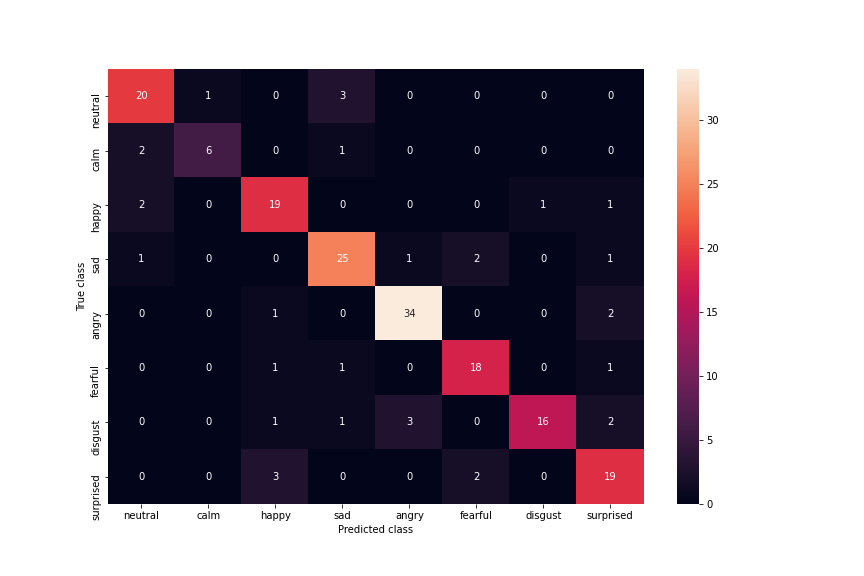

# SpeechEmotion

LSTM Neural network for emotion classification in speech. 

## Preprocessing the data

Training and evaluation data is taken from two datasets:

* The Ryerson Audio-Visual Database of Emotional Speech and Song ([RAVDESS](https://zenodo.org/record/1188976#.YVET-FUzbIW)). This dataset contains samples recorded by 24 different male and female actors. Each actor recorded 60 samples with 8 different emotions (imbalanced). Emotions present in this dataset are: neutral, calm, happy, sad, angry, fearful, disgust and surprised.
* Toronto Emotional Speech Set ([TESS](https://tspace.library.utoronto.ca/handle/1807/24487)). This dataset contains samples recorded by 2 female actors. Each actor recorded 1400 samples with 7 emotions (balanced). Emotions present in this dataset are: neutral, happiness, sadness, anger, fear, disgust, pleasant and surprise.

Each file name in RAVDESS dataset contains emotion coded in 7th and 8th character (eg. 03 means "happy") and each file name in TESS dataset contains emotion written as string (eg. happy).

All samples from both datasets are preprocessed with these steps using [librosa](https://librosa.org/doc/latest/index.html) package for audio processing:

1. Normalization
2. Silence trimming
3. Padding
4. Noise reduction

After preprocessing the features for neural network are extracted from the file. The features extracted are:

* Zero crossing rate
* Mean root square (Energy)
* Mel-frequency cepstral coefficients (MFCCs)

Features for each file are extracted for every frame of an audio with the fixed specified frame length and hop. All audio records are padded according to the longest audio in the dataset and after preprocessing all samples have the same length when converted to array. Each sample contains 339 x 15 features: 339 frames with 13 MFC coefficients, 1 for ZCR and 1 for MRS. All samples with extracted features are saved in json format on the specified location. Emotions extracted based on file name are also saved.

## Training and evaluating the model

Model used for emotion classification is 2 Layer LSTM Neural Network with 64 cells in each layer. Input shape of the first LSTM layer must correspond to the shape of the input data (in this case 339 x 15).

Callbacks are used to reduce overfitting and enhance model performances during training and validation. The callbacks used are:

* Reduce on plateau: Learning rate gets reduced by 10% after when model metrics aren't improving on validation dataset after 100 epochs
* Save best coefficients: To remove the unwanted effect of overfitting, model coefficients that have the best validation accuracy are saved to specified location. 

Data is divided in 85-15-5 ratio for training test and validation set. Training is performed in 300 epochs in batch mode with batch size 23. Categorical features are one-hot encoded.

Model achieves 84% accuracy on validation set and 8 and 82% accuracy on the test set.

## Testing for the new input

Model architecture and coefficents are saved after traning and can be loaded after and tested on different recorded audios. Script for recorded audios `record_wav.py` recordes an mono audio in wave audio format sampled in 24kHz. In script `test_for_audio.py` a newly recorded wav file can be specified and tested. Model and coefficients are intially loaded from specified paths and model needs to be compiled in the same way like in training. Output of the model is the emotion prediction and plot of model confidence for every emotion.
